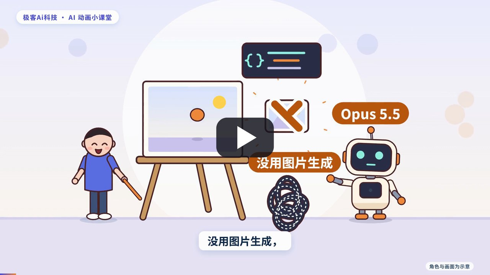
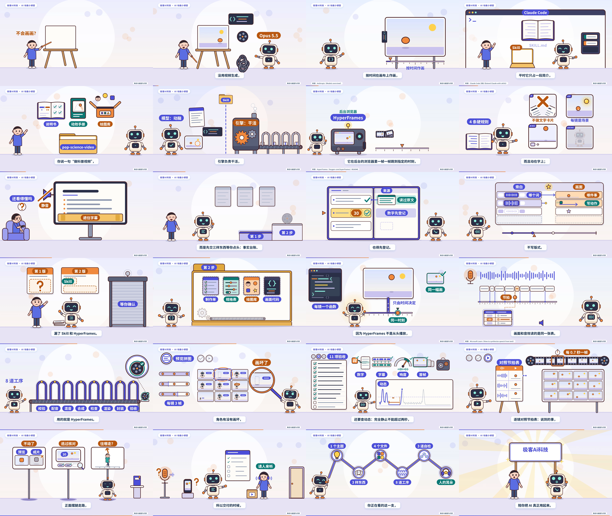

# pop-science-video

一个 Claude Code 技能（Skill）加一台出片引擎：给一个主题，模型先写脚本和节拍表等你确认，再写逐帧绘图代码，引擎负责配音、合成、渲染和验收，做出一支画面一直在演的科普动画。

不用图片生成，不用视频生成，也不用剪辑软件。画面是代码在一块 Canvas 上按时间画出来的，由 [HyperFrames](https://github.com/heygen-com/hyperframes) 逐帧渲染。

A Claude Code skill plus a small render engine for narrated explainer animations. The model writes the script, a beat table and the frame-by-frame drawing code; the engine does text-to-speech, mixing, compositing, HyperFrames rendering and verification. No image or video generation models involved. Documentation is in Chinese.

## 样片

[](https://youtu.be/ogl79nqNduM)

点上面的封面在 [YouTube](https://youtu.be/ogl79nqNduM) 上看；仓库里也有一份压缩过的文件 [demo/opus_animation.mp4](demo/opus_animation.mp4)。

《不会画画也能做动画：Opus 5.5 出片工作流全拆解》，6 分 05 秒，1920×1080。这支片子讲的就是本仓库这套流程，它自己也是用这套流程做出来的；完整工程在 [examples/opus_animation/](examples/opus_animation/)。



它是一支演示用的样片，不是精修过的成品。独立复核指出的问题（例如第二镜开场约 3 秒几乎全静止）都如实写在 [SCRIPT.md 的“已知的不足”](examples/opus_animation/SCRIPT.md#已知的不足)里，没有再改。

## 它怎么工作

```text
你给一个主题
   │
   ▼
第一步  模型交三样东西，等你确认
        事实台账   每个说法写明来源，来源要真的打开读过
        旁白       口语短句，每镜一段
        节拍表     旁白说到哪个词，画面里发生哪件事
   │    （不满意就打回重写）
   ▼
第二步  模型写四个文件
        production-sheet.md   制作单：台账和旁白
        episode.spec.json     规格：节拍短语、音效、配乐、阈值
        kit.mjs               绘图库：角色、镜头、转场、道具
        visuals.mjs           画面代码：每镜一个函数，画面只由时间决定
   │
   ▼
引擎    校验 → 配音 → 混音 → 合成 → 检查 → 渲染 → 封装 → 验收
        配音用 Azure 语音合成，逐词时间把每个节拍钉在那个词上
        检查和渲染用 HyperFrames
   │
   ▼
三道自检
        预览拼图     每镜三帧，模型自己看有没有画坏
        引擎验收     十一项，含“完全静止不超过 2 秒”
        逐段看成片   每 0.7 秒抽一帧，对照节拍表
```

引擎不调用大模型；脚本、事实核实和画面代码由执行技能的模型完成。

这套做法的核心是两条：

- **动作钉在字上。** 节拍短语取自旁白原文，配音给出每个词的时间，画面和音效读同一张表。
- **画面是时间的纯函数。** 同一个时刻永远画出同一幅画，渲染器才能跳着取帧，模型也才能随时取任意一帧来检查。

## 仓库里有什么

| 路径 | 内容 |
|---|---|
| [.claude/skills/pop-science-video/](.claude/skills/pop-science-video/) | 技能本体：[SKILL.md](.claude/skills/pop-science-video/SKILL.md)（流程、四条硬规则、三道自检、踩过的坑）、[动效手册](.claude/skills/pop-science-video/references/motion-grammar.md)、[写镜约定](.claude/skills/pop-science-video/references/scene-guide.md)、[绘图库 kit.mjs](.claude/skills/pop-science-video/references/kit.mjs) |
| [engine/](engine/) | 出片引擎（Python 加一个 Node 脚本）和它的测试，说明见 [engine/README.md](engine/README.md) 与 [engine/STAGE_CONTRACT.md](engine/STAGE_CONTRACT.md) |
| [tools/](tools/) | 安装脚本；长片用的分镜拼装工具 `build.py`、取帧 `snap.sh`、查节拍时刻 `beats.py` |
| [examples/opus_animation/](examples/opus_animation/) | 样片的完整工程：制作单、[脚本与节拍表](examples/opus_animation/SCRIPT.md)、23 镜画面代码 |
| [demo/](demo/) | 样片和它的封面、逐镜拼图、机器人姿态图、验收记录 |

## 开始用

需要：

- macOS 或 Linux。目前只在 macOS（Apple Silicon）上跑过，其他环境没有验证。
- Node.js 22 以上、FFmpeg、Python 3。
- [Claude Code](https://claude.com/claude-code)，或别的支持 Skill 的编程助手。模型需要能读图，因为自检要看拼图。
- 一个 Azure 语音服务（Speech）的密钥，配音用。

```sh
git clone https://github.com/mofyer/pop-science-video.git
cd pop-science-video
tools/setup.sh              # 安装 HyperFrames、GSAP，建 Python 虚拟环境
```

把语音服务的密钥放到自己的配置目录里，不要放进仓库：

```sh
mkdir -p ~/.config/pop-science-video
cat > ~/.config/pop-science-video/azure-speech.env <<'EOF'
AZURE_SPEECH_KEY=你的密钥
AZURE_SPEECH_REGION=你的区域
EOF
chmod 600 ~/.config/pop-science-video/azure-speech.env
./make-episode doctor       # 环境自检
```

然后在仓库根目录启动 Claude Code，对它说：

```text
做科普视频：为什么飞机在万米高空飞
```

它会先交事实台账、旁白和节拍表等你确认，确认后在 `episodes/<名称>/` 里写文件并出片。

### 先看看样片怎么跑

```sh
./make-episode preview examples/opus_animation   # 静音预览，每镜三帧，不需要密钥
./make-episode run examples/opus_animation       # 全流程出片；会调用语音合成，约 1700 个字符
```

全流程出片需要先放好密钥文件。验收的最后一项会读取它，用来检查期目录里有没有混进密钥；读不到就记为未通过。

样片是分镜写的，源文件在 `examples/opus_animation/src/`，改完某一镜后用 `python3 tools/build.py examples/opus_animation` 重新拼出画面文件和规格。

## 边界

- 配音只接了 Azure 语音合成，音色是中文的晓伊和晓秋。换语音服务需要改 `engine/tts_azure.py`，它必须能给出逐词时间。
- 画面风格由绘图库决定：明亮的平涂卡通、一个小机器人主持人、一个通用小人。想换风格或换角色，要自己往 `kit.mjs` 里加绘图函数。
- 读音、配乐和音效的听感，模型判断不了，出片后要人来听。
- 引擎的十一项验收只能证明成片格式正确、画面在动、数字有出处，不能证明内容正确，也不能证明好看。
- 期目录里的 `visuals.mjs` 和 `kit.mjs` 是会在本机的 Node 和浏览器里执行的代码。引擎会拦下一批危险写法，但这不是沙箱：不要运行来源不明的期目录。

## 许可与致谢

本仓库的代码、文档和样片以 [MIT 许可](LICENSE)发布。

它依赖这些项目，各自的许可以它们为准：

- [HyperFrames](https://github.com/heygen-com/hyperframes)（Apache-2.0）：把网页渲染成视频。
- [GSAP](https://gsap.com/)：HyperFrames 页面里的时间线，安装时由 npm 取得，不随本仓库分发。
- [Noto Sans SC](https://fonts.google.com/noto/specimen/Noto+Sans+SC)（SIL Open Font License 1.1）：字幕和标签字体，随仓库分发，许可文本在 `engine/shared/public/`。
- Azure 语音合成：配音服务，需要自备密钥。

样片里的机器人只是示意角色，与 Anthropic、Claude、HeyGen 均无关联，也不代表它们的官方立场。
